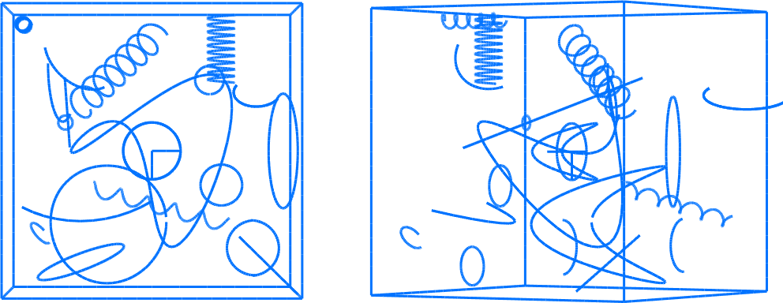

# Synthetic Curves Multiview Dataset



## Overview

- **40 curves**: Lines, circles, ellipses, helices, and another space curve with complicated torsion, sampled to generate **5117 points** with attributed orientation, curvature and torsion
- Cameras in three geometries:
  - Sherical video camera configuration: **100 views**
  - Turntable video camera configuration
  - Micro-CT configuration (objects lying between optical center and CCD)
- Space curves are sampled and projected to subpixel edgels (tangent and other differential-geometric information) to generate a video. The differential geometry arises by projecting the 3D measurements according to "Multiview Differential geometry of Curves", IJCV 2016.
- Each image is 500x400 px, but samples are subpixel


## Details

### Spherical dataset 
The analytic space
curves shown are synthesized in a 4x4 cm^3 volume and projected to 100 cameras and are sampled to get
5117 potential data points/tangents that are the projections of the same 3D
analytic points and tangents.  Camera centers are randomly sampled around an
average sphere around the scene along normally distributed radii of mean
1m and sigma = 10mm. Rotations are constructed via normally distributed look-at
directions with mean along the sphere radius looking to the object, and sigma
0.01 rad such that the scene does not leave the viewport, followed
by uniformly distributed roll. This sampling is filtered such that no two
cameras are within 15 degrees of each other.  Each camera encompasses a
500 x 400 pixel viewport, where the entire dataset is always
visible at sub-pixel precision with no more than one sample per pixel.  These
curve samples are then degraded with noise and mismatches.  The image location
and tangent orientation are perturbed to simulate measurement noise in the range
of 0-2 pixels in location and 0-10 degrees in orientation. 
We add uniform noise to each point coordinate in the range
(-Delta_pos, Delta_pos), with Delta_pos in {0,0.5,1,2}, and add uniform angular
noise to the tangent vector in the range 
(-Delta_theta, Delta_theta), for Delta_theta in {0, 0.5,
1, 5, 10} degrees.  

## Download
[Git LFS](https://git-lfs.github.com) (Large File Storage) is *required* for
downloading and uploading from/to this dataset repository.  Otherwise, you will
get tiny text files instead of actual big files.

Install [Git LFS](https://git-lfs.github.com) and then, after cloning the
repository, run
```
  git lfs pull
```
Thanks to Irina Nurutdinova, TU Berlin, for testing this out.

## Files

```
ascii-20_views-olympus-turntable/    txt's for 20 views, cams and point-tangents
ascii-20_views-olympus-turntable/src/*.cxx    snapshot of original VXD code used to generate the data
ascii-20_views-olympus-turntable/src/*.sce    snapshot of original Scilab code used to validate the data

Same naming scheme for the spherical dataset folder:
spherical-ascii-100_views-perturb-radius_sigma10-normal_sigma0_01rad-minsep_15deg-no_two_cams_colinear_with_object

misc/

misc/old     used for ECCV'12 and IJCV'16, as well as CVPR'10
```

## Format for ASCII datasets

```
calib.intrinsic    the K matrix when it is the same for every view

```

For each view, say, view number 0014, and for each curve sample, say, 691,
we provide the following 20-digit precision data in text form:

```
frame_0014-pts-2D.txt     x y coordinates of point 691, at line 691
frame_0014-tgts-2D.txt    t_x t_y coordinates of tangent 691, at line 691
crv_ids.txt               curve number of point 691, at line 691 (curves are numbered 0 to n_curves-1)
crv-3D-pts.txt            X Y Z coordinates of 3D point 691 corresponding to 2D point 691
crv-3D-tgts.txt           T_X T_Y T_X coordinate of 3D tangent 691
frame_0014.extrincic      camera model for frame 0014. Format:

                          Rot Rot Rot
                          Rot Rot Rot
                          Rot Rot Rot
                          C_X C_Y C_z
                          
                          where C = (C_X, C_Y, C_Z) is the camera center, *not*
                          the translation vector, which would be T = -RC
```

## Version

Dataset produced and tested in C++ with the [VXD](http://github.com/rfabbri/vxd) library
under Mac OS X.

## Authors

[Ricardo Fabbri](http://rfabbri.github.io) built the dataset.
Fostered by Benjamin Kimia, Brown University.

## Citing the dataset

Please cite the paper for projection and reconstruction of
differential-geometric properties - Fabbri and Kimia IJCV 2016:

```bibtex
@article{Fabbri:Kimia:IJCV2016,
  title={Multiview Differential Geometry of Curves},
  author={Fabbri, Ricardo and Kimia, Benjamin B},
  journal={International Journal of Computer Vision},
  pages={1--23},
  year={2016},
  volume = {117},
  doi="10.1007/s11263-016-0912-7",
  url="http://dx.doi.org/10.1007/s11263-016-0912-7",
  publisher={Springer}
}
```


Please cite the original paper this dataset appeared in:

```bibtex
@inproceedings{Fabbri:Giblin:Kimia:ECCV12,
    Author         = {Ricardo Fabbri and Peter J. Giblin and Benjamin B. Kimia},
    Booktitle      = {Proceedings of the IEEE European Conference in Computer Vision},
    Crossref       = {ECCV2012},
    Title          = {Camera Pose Estimation Using First-Order Curve Differential Geometry},
    Year           = {2012}
}

@proceedings{ECCV2012,
  title     = {Computer Vision - ECCV 2012, 12th European Conference on
               Computer Vision, Firenze, Italy, October 7-13,
               2012, Proceedings},
  booktitle = {12th European Conference on
               Computer Vision, Firenze, Italy, October 7-13,
               2012},
  publisher = {Springer},
  series    = {Lecture Notes in Computer Science},
  year      = {2012}
}
```

## Credits

We also acknowledge ICERM/Brown University, FAPERJ/Brazil and NSF support.

## Links

Images and explanations of this ground truth are provided in:
http://Multiview-3d-Drawing.sf.net

